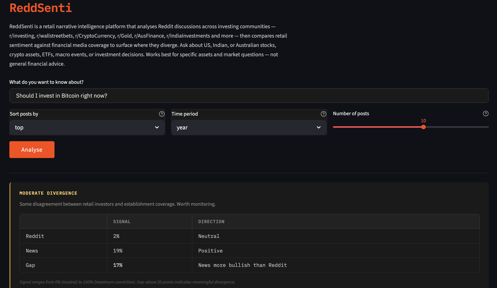
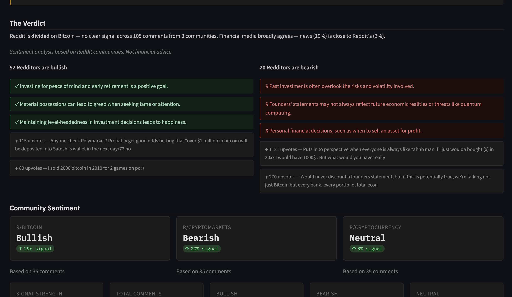
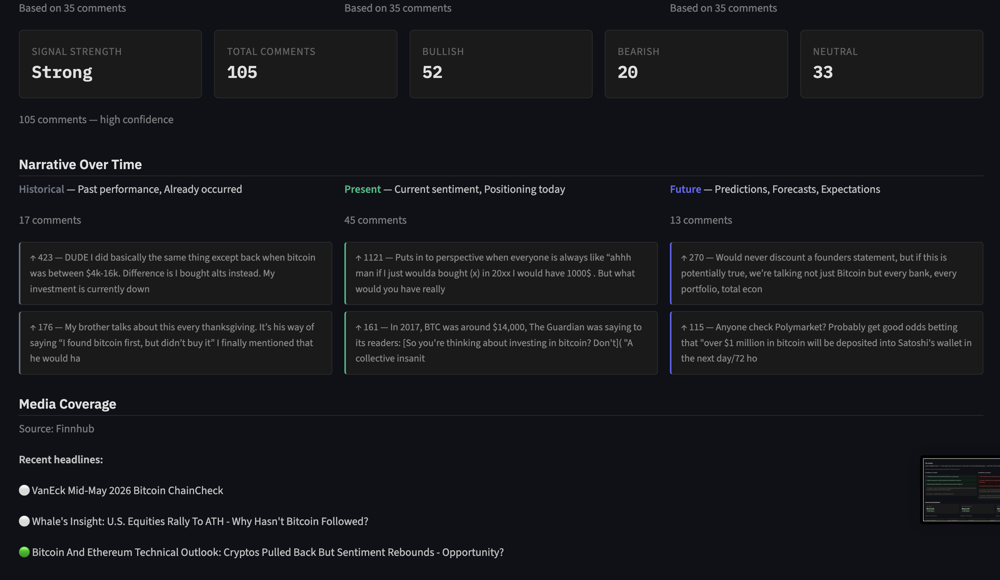

# ReddSenti — Retail Narrative Intelligence

> **The divergence is the signal.**

When Reddit is strongly bullish and financial media is bearish — or vice versa — that gap tends to precede elevated volatility. ReddSenti makes that signal visible.

---

## Why This Matters

Retail investors now account for **25% of US equity trading volume** — up from 10% pre-pandemic. **37% of young adults use Reddit as their primary financial information source** (Forbes Advisor, 2023).

We've seen what happens when retail sentiment moves in a direction the establishment isn't watching:

- **GameStop (2021)** — r/wallstreetbets drove a 1,500% short squeeze that blindsided hedge funds
- **Bitcoin cycles** — Reddit communities consistently front-run institutional coverage
- **AI stock rallies** — retail enthusiasm on r/investing preceded mainstream analyst upgrades

The problem isn't that retail investors lack information. It's that they have no easy way to combine what their community thinks with what professional media is reporting — and understand the gap between the two.

ReddSenti bridges that gap.

---

## Why It's Different

Most Reddit sentiment tools count mentions. ReddSenti does something different:

| Other tools | ReddSenti |
|---|---|
| Track mention volume | Extracts actual investment arguments |
| Single data source | Compares Reddit against financial media |
| One community | Segments by investor tribe — WSB vs r/investing vs r/Gold |
| Static sentiment score | Surfaces narrative divergence as a volatility signal |
| Built for institutions | Built for retail investors making real decisions |

---

## What It Does

Type any financial question. Get:

- **A verdict** — what Reddit actually thinks, in plain English
- **The divergence** — where retail sentiment and financial media disagree
- **Bull and bear cases** — extracted from real comments by a local LLM
- **Investor tribe breakdown** — how different Reddit communities disagree with each other
- **Narrative over time** — what happened before, what people think now, what they expect next
- **Specific recommendations** — what Reddit is actually suggesting when you ask "which ETF?"

**Works best for:**
`Should I buy NVDA stock?` · `Is Bitcoin a good investment?` · `How is Reddit reacting to Trump's tariffs?` · `Which mutual funds should I invest in India?` · `Is real estate better to buy or rent?`

---

## Screenshots

*Query: "Should I invest in Bitcoin right now?"*




---

## Example Insights

**Indian mutual funds** — Retail investors remain bullish on long-term mutual fund investing even while financial media turns cautious — a 39% sentiment gap suggesting retail conviction is outpacing institutional narratives.

**Bitcoin** — Sentiment wasn't simply bullish or bearish. Long-term holders in r/Bitcoin stayed optimistic while active traders in r/CryptoMarkets turned bearish — a clear divide between conviction investors and tactical traders.

**Trump's tariffs** — Macro-focused communities were strongly bearish, but stock-focused investors still saw upside in manufacturing and chips — showing how the same event creates completely different market narratives across investor groups.

---

## How It Works

```
Query → Phi-3 understands intent → Reddit communities identified
→ Comments fetched in parallel → Preprocessed → AI relevance filtering
→ Financial sentiment scored → News fetched and compared
→ Phi-3 extracts bull/bear thesis → Divergence surfaced → UI rendered
```

**Key pipeline steps:**

| Step | What happens |
|---|---|
| Query parsing | Phi-3 (local LLM) extracts entity, intent, search term |
| Community selection | 30+ subreddit mappings across 18 categories — top 3 by relevance kept |
| Preprocessing | URLs, HTML, markdown removed; capitalisation preserved for sentiment accuracy |
| AI relevance filtering | Cross-encoder reranker filters 50+ comments to 35 most relevant |
| Sentiment scoring | VADER + Loughran-McDonald Financial Lexicon (2,709 finance-specific terms) |
| News routing | 11-path system — Finnhub for tickers, NewsAPI for macro/India/crypto, Guardian for UK |
| Thesis extraction | Phi-3 reads top comments and extracts investment arguments in plain English |

---

## Tech Stack

| Component | Technology |
|---|---|
| UI | Streamlit |
| Query understanding + thesis extraction | Microsoft Phi-3 via Ollama (local, free) |
| Semantic embeddings | all-MiniLM-L6-v2 (sentence-transformers) |
| Relevance reranking | cross-encoder/ms-marco-MiniLM-L-6-v2 |
| Sentiment | VADER + Loughran-McDonald Financial Lexicon 2025 |
| Fallback relevance | TF-IDF (sklearn) |
| News APIs | Finnhub, NewsAPI, Guardian Open Platform |
| Reddit data | Public JSON endpoints — no API key required |

**No OpenAI or paid LLM APIs used.** All models run locally.

---

## Setup

**Prerequisites:** Python 3.12+, [Ollama](https://ollama.com/download)

```bash
git clone https://github.com/saloni664yml/reddsenti.git
cd reddsenti
python -m venv .venv && source .venv/bin/activate
pip install -r requirements.txt
cp config.example.py config.py  # add your API keys
ollama pull phi3                  # one-time ~2GB download
streamlit run app.py
```

**Free API keys needed:** [Finnhub](https://finnhub.io) · [NewsAPI](https://newsapi.org) · [Guardian](https://open-platform.theguardian.com)

---

## Coverage

**Markets:** US · India · Australia · UK · Canada · Europe · China · Emerging Markets

**Communities include:** r/investing · r/wallstreetbets · r/CryptoCurrency · r/bitcoin · r/Gold · r/IndiaInvestments · r/IndianStockMarket · r/AusFinance · r/personalfinance · r/Bogleheads · r/realestate · r/FirstTimeHomeBuyer · r/Biotech · r/SecurityAnalysis · and 20+ more

---

## Known Limitations

- Very local queries ("best broker in Sydney") return limited results — Reddit lacks concentrated local discussion
- Very recent events may underrepresent — sorted by top posts over past year
- WSB-specific slang ("diamond hands", "to the moon") partially missed by VADER + LM lexicon
- Phi-3 requires Ollama running locally — falls back to rule-based extraction if unavailable
- Not financial advice

---

## Future Improvements

- Finance-specific retrieval model trained on Reddit financial communities
- Real-time sentiment tracking (not just historical top posts)
- Stronger WSB slang and sarcasm detection
- FinBERT integration for earnings call and analyst report sentiment
- Multilingual support for non-English investing communities
- Historical divergence tracking — how past Reddit/media gaps resolved
- API endpoint for embedding sentiment data in other products

---

## Author

**Saloni Goyal** — BCom (Business Analytics & Finance), UNSW Sydney

🌐 [LinkedIn](https://www.linkedin.com/in/saloni-goyal-74a967226/)

---

*MVP complete. Actively developed.*
